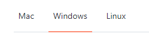

# Getting Set Up For Gamemaker Studio

## Create a GitHub Account

1. Go to [GitHub.com](https://github.com)
2. Click the `Sign up` button

   
3. Follow the prompts to create your account
    * Apparently this process has gotten _weird_... They tried to make creating
      an account a "fun" process.

## Install Git

_git != GitHub_

### Operating System Specifics

#### Windows

1. Go to [git-scm.com/downloads](https://git-scm.com/downloads)
2. Download for Windows
3. You should be able to accept all default options during installation

#### Mac

1. Go to [git-scm.com/downloads](https://git-scm.com/downloads)
2. Download for macOS
3. You should be able to accept all default options during installation

#### Linux

Sadly GameMaker does not run on Linux... Please use a different OS.

### Git Configuration

1. Open GitBash or a terminal, depending on your OS.
2. Run the following commands:
   * Set your name that will be used for _commits_
     ```bash
     git config --global user.name "YOUR_NAME"
     ```
   * Set your email that will be included in your _commits_
     ```bash
     git config --global user.email YOUR_EMAIL_ASSOCIATED_WITH_GITHUB
     ```

## Setting Up Your SSH Key

### Why use an SSH key? 

To avoid having to type in your GitHub password every time you want to push code!

### Creation

**Note**: near the top of each of these pages you can select which operating system you are using.



The OS the underline is highlighted under, is the currently selected OS. The
instructions will change slightly to accommodate OS specific commands.

1. Check for an existing SSH key using [this guide](https://docs.github.com/en/authentication/connecting-to-github-with-ssh/checking-for-existing-ssh-keys)
2. Create a new SSH key if one does not already exist using [this guide](https://docs.github.com/en/authentication/connecting-to-github-with-ssh/generating-a-new-ssh-key-and-adding-it-to-the-ssh-agent)
   * As long as you are using a personal computer, you can skip setting a passphrase by simply pressing the `ENTER` key 
     when prompted, and again when asked to re-type the passphrase.
3. Add your SSH key to your GitHub account using [this guide](https://docs.github.com/en/authentication/connecting-to-github-with-ssh/adding-a-new-ssh-key-to-your-github-account)
4. Test if the SSH key was added successfully using [this guide](https://docs.github.com/en/authentication/connecting-to-github-with-ssh/testing-your-ssh-connection)

## Create your GameMaker Account

1. Go to [gamemaker.ioo/account](https://gamemaker.io/account/)
2. Gamemaker uses Opera accounts. If you already have an Opera account, you can
   just sign in. Otherwise, create and register a new Opera account using the
   `REGISTER` button.

## Install GameMaker Studio

1. Go to [gamemaker.io/en/download](https://gamemaker.io/en/download)
2. Click the `DOWNLOAD` button for your OS
3. Run the installer
   * Default options should be fine
4. You will likely be asked to log into your Gamemaker account at some point
